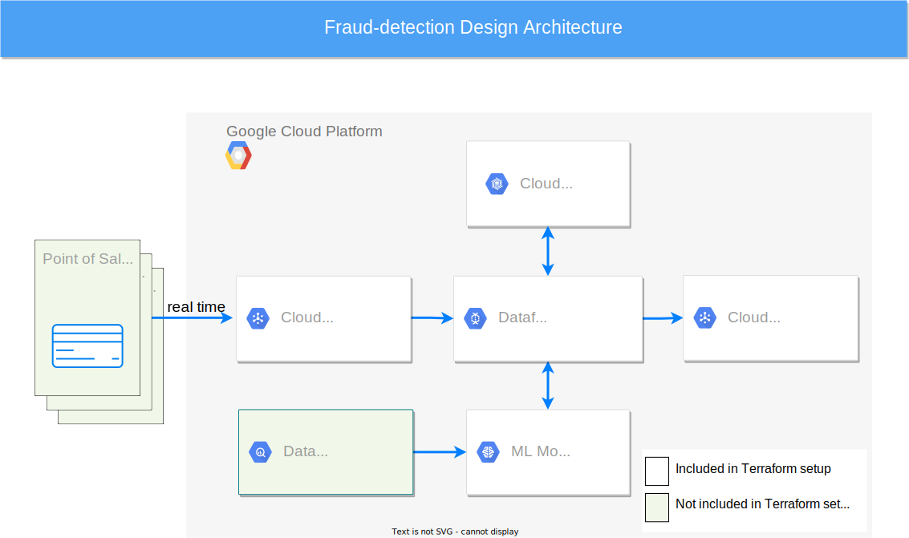

# Credit card fraud detection using Cloud Bigtable

This sample application aims to build a fast and scalable fraud detection system
using Cloud Bigtable as its feature store. The feature store holds customer
profiles
(customer ids, addresses, etc.) and historical transactions. In order to
determine if a transaction is fraudulent, the feature store queries the customer
profile information and transaction history.

Cloud Bigtable is a great fit to use as a feature store for the following
reasons:

1. **Scalable:** Cloud Bigtable can handle petabytes of data, allowing the fraud
   detection service to scale to many customers.

2. **Fast:** It has a very low latency which helps in this use case because the
   system needs to identify if a transaction is fraudulent or not as soon as
   possible.

3. **Managed service:** Cloud Bigtable provides the speed and scale all in a
   managed service. There are also maintenance features like seamless scaling
   and replication as well as integrations with popular big data tools like
   Hadoop, Dataflow and Dataproc.

## System design



**1. Input/Output Cloud Pub/Sub topics:** The real-time transactions arrive at
the Cloud Pub/Sub input topic, and the output is sent to the Cloud Pub/Sub
output topic.

**2. ML Model:** The component that decides the probability of a transaction of
being fraudulent. This sample application provides a pre-trained ML model and
hosts it on VertexAI ([See ML Model section](#ml-model)).

**3. Cloud Bigtable as a Feature Store:** Cloud Bigtable stores customer
profiles and historical data. The Dataflow pipeline queries Cloud Bigtable in
real-time and aggregates customer profiles and historical data.

**4. Dataflow Pipeline:** The streaming pipeline that orchestrates this whole
operation. It reads the transaction details from the Cloud Pub/Sub input topic,
queries Cloud Bigtable to build a feature vector that is sent to the ML model,
and lastly, it writes the output to the Cloud Pub/Sub output topic.

**5. Data warehouse (BigQuery, Spark, etc):** This component stores the full
history of all transactions queried by the system. It runs batch jobs for
continuously training the ML model. Note that this component is outside the
scope of this sample application as a pre-trained ML model is provided for
simplicity.

The system design is written using the Terraform framework. All components'
details can be found in the file **terraform/main.tf** and it includes the
components listed above.

## Datasets

This sample application
uses [Sparkov Data Generation Simulator](https://github.com/namebrandon/Sparkov_Data_Generation)
to generate the datasets that are used for training the ML model and for testing
it.

The directory **terraform/datasets/training_data** stores the datasets used for
training the ML model. A pre-trained ML model comes with this sample
application, but a custom ML model can be trained as well.

The directory **terraform/datasets/testing_data** stores the datasets that can
be used for testing the ML model. The ML model was never trained against these
transactions. Two testing datasets are provided: a dataset containing fraudulent
transactions, and another dataset containing legitimate transactions.

## Cloud Bigtable

### Schema design

Cloud Bigtable stores data in tables, each of which is a sorted key/value map.
The table is composed of rows, each of which typically describes a single
entity, and columns, which contain individual values for each row. Each
row/column intersection can contain multiple cells. Each cell contains a unique
timestamped version of the data for that row and column.

This design uses a single table to store all customers' information
following [table design best practices.](https://cloud.google.com/bigtable/docs/schema-design#tables)
The table is structured as follows:

| row key   |   customer_profile column family   | historical transactions column family |  
|-----------|:----------------------------------:|--------------------------------------:|
| user_id 1 |   Customer’s profile information   |        Transaction details at time 10 |   
|           |                                    |         Transaction details at time 7 |
|           |                                    |         Transaction details at time 4 |
|           |                                    |                                   ... |
| user_id 2 | Customer’s profile information |         Transaction details at time 8 |   
|           |                                    |         Transaction details at time 7 |
|           |                                    |                                   ... |

**Row Key:** The row key is the unique userID.

**Timestamps:** Cloud Bigtable Native timestamps are used rather than putting
the timestamp as the row key suffix.

### Column families

The data is separated over two column families. Having multiple column families
allows for different garbage collection policies (See garbage collection
section). Moreover, it is used to group data that is often queried together.

**Customer Profile Column Family:** This column family contains the information
about customers like. Usually, each customer will have one value for each column in
this column family.

**History Column Family:** This column family contains the historical
transaction that this specific user had before. The dataflow pipeline aggregates
the data in this column family and sends them along with the customer profile
data to the ML model.

### Cloud Bigtable configurations

**Number of nodes**

The Terraform code creates a Cloud Bigtable instance that has 1 node. This is a
configurable number based on the amount of data and the volume of traffic
received by the system. Moreover, Cloud Bigtable
supports [autoscaling](https://cloud.google.com/bigtable/docs/autoscaling) where
the number of nodes is dynamically selected based on the current system load.

**Garbage Collection Policy**

The current Terraform code does not have any garbage collection policies.
However, it could be beneficial for this use case to set a garbage collection
policy for the History column family. The ML model does not need to read all the
history of the customer. For example, you can set a garbage collection policy to
delete all transactions that are older than `N` months but keep at least `M`
last transactions. The customer profile column family could have a policy that
prevents having more than one value in each column. You can read more about
Cloud Bigtable Garbage Collection Policies by
reading: [Types of garbage collection](https://cloud.google.com/bigtable/docs/garbage-collection#types)

**Replication**

The current Cloud Bigtable instance configuration does not provide any
replication. However, in order to improve the system availability and lower the
latency for transactions in different regions, the table can be replicated into
multiple zones. This will make the system eventually consistent, but in a
use-case like fraud detection eventual consistency usually works well. You can
learn more by
reading [Cloud Bigtable replication use cases](https://cloud.google.com/bigtable/docs/replication-overview#use-cases)
.

## ML Model

This sample application provides a pre-trained Boosted Trees Classifier ML model
that uses similar parameters to what was done
here: [How to build a serverless real-time credit card fraud detection solution](https://cloud.google.com/blog/products/data-analytics/how-to-build-a-fraud-detection-solution)

The ML model is located in the path: **terraform/model**

## How to Use

### Prerequisites

1) [Have a GCP project.](https://cloud.google.com/resource-manager/docs/creating-managing-projects)
2) [Have a service account that contains the following permissions:](https://cloud.google.com/docs/authentication/production)
    1) Bigtable Administrator
    2) Cloud Dataflow Service Agent
    3) Compute Admin
    4) Dataflow Admin
    5) Dataflow Worker
    6) Datapipelines Service Agent
    7) Storage Admin
    8) Vertex AI User
3) Set these environment variables:

```
export GOOGLE_APPLICATION_CREDENTIALS={YOUR CREDS PATH}
export PROJECT_ID={YOUR PROJECT ID}
```

### Running steps

**1) Build the infrastructure**

```
cd terraform
terraform init
terraform apply -var="project_id=$PROJECT_ID"
```

This builds the infrastructure shown above, populates Cloud Bigtable with
customer profile data, and populates Cloud Bigtable with customers’ historical
data. It takes about 5-10 minutes to finish. It builds the following resources:

| Resource                                 | Resource Name                                                                                                                               |
|------------------------------------------|---------------------------------------------------------------------------------------------------------------------------------------------|
| Cloud Bigtable Instance                  | featurestore-{RANDOM\_ID}                                                                                                                   |
| Cloud Bigtable Table                     | customer-information-{RANDOM\_ID}                                                                                                           |
| Cloud Bigtable Column Family             | customer_profile, history                                                                                                                   |
| Cloud Pubsub Input Topic                 | transaction-stream-{RANDOM\_ID}                                                                                                             |
| Cloud Pubsub Output Topic                | fraud-result-stream-{RANDOM\_ID}                                                                                                            |
| Cloud Pubsub Output Subscription         | fraud-result-stream-subscription-{RANDOM\_ID}                                                                                               |
| Google Storage Bucket                    | fraud-detection-{RANDOM\_ID}                                                                                                                |
| Google Storage Objects                   | * temp/ (*for temporary dataflow generated files*) <br/> * testing_dataset/ <br/>* training_dataset/ <br/>* ml_model/                       |
| VertexAI Model                           | fraud-ml-model-{RANDOM\_ID}<br/>                                                                                                            |
| VertexAI Endpoint                        | *The endpoint Id is determined in runtime, stored in Scripts/ENDPOINT\_ID.output*                                                           |
| Dataflow Load Customer Profiles Data Job | load-customer-profiles-{RANDOM\_ID} (*batch job that loads customer profiles data from GS to Cloud Bigtable*)                               |
| Dataflow Load Historical Data Job        | load-customer-historical-transactions-{RANDOM\_ID} (*batch job that loads historical data from GS to Cloud Bigtable*)                       |
| Dataflow Fraud Detection Job | fraud-detection-{RANDOM\_ID} (*streaming job that listens to the input Pub/Sub topic and produces the results to the output Pub/Sub topic*) |

*Note: For simplicity, running the Terraform commands will build the
infrastructure mentioned above and then run 2 Java programs that will create the
Dataflow pipelines. Alternatively, you could create a Dataflow template and let
Terraform deploy those templates rather than running the Java code inside
Terraform code.*

You can know all the names of the created resources by running:

```
terraform output
```

**2) Interacting with the environment**

Send transactions to the Cloud Pub/Sub input topic, and wait for the results in
the output topic. To do this, you can
use [gcloud](https://cloud.google.com/pubsub/docs/publish-receive-messages-gcloud#publish_messages)
, any of
the [Pub/Sub client SDKs](https://cloud.google.com/pubsub/docs/publish-receive-messages-client-library#publish_messages)
, or
the [console](https://cloud.google.com/pubsub/docs/publish-receive-messages-console#publish_a_message_to_the_topic)

For example, you can pick transactions from **
terraform/Datasets/testing-data/fraud_transactions.csv**
that follow this pattern stored in **
terraform/Datasets/testing-data/transactions_header.csv**

Transaction header:

```
user_id, unix_time_millisecond, transaction_num, amount, merchant_id, merch_lat, merch_long, is_fraud
```

Submitting a transaction example

```
INPUT_TOPIC=$(terraform output pubsub_input_topic | tr -d '"')
SUBSCRIPTION=$(terraform output pubsub_output_subscription | tr -d '"')
TRANSACTION="3563761482, TimestampMilliseconds=1647487125000, eb0e996a46d9f80d7339398d2c653639, 937.02, 188548615082, 38.806136, -90.321706, ?"

gcloud pubsub topics publish $INPUT_TOPIC --message="$TRANSACTION"
gcloud pubsub subscriptions pull $SUBSCRIPTION --auto-ack
```

Output example (in this case the transaction was fraudulent):

```
Transaction id: eb0e996a46d9f80d7339398d2c653639, isFraud: 1
```

**3) Resource cleanup**

You can destroy all the resources created by running the following command:

```
terraform destroy -var="project_id=$PROJECT_ID"
```

### Changing System Components

**Replacing the ML model**

You can change the ML model simply by swapping the terraform/model/model.bst
with your model. Terraform deploys it to VertexAI and exposes the endpoint.

**Changing the Dataset**

The following steps are needed to change the dataset:

1) Replace the customer profile and historical datasets in
   terraform/datasets/training_data.
2) Train an ML model using the new dataset, and follow the steps above for
   replacing the ML model.
3) Add the new fields to CustomerProfile, and TransactionDetails classes.
4) Potentially, change the AggregatedData class to generate a new feature vector
   based on the new dataset.


