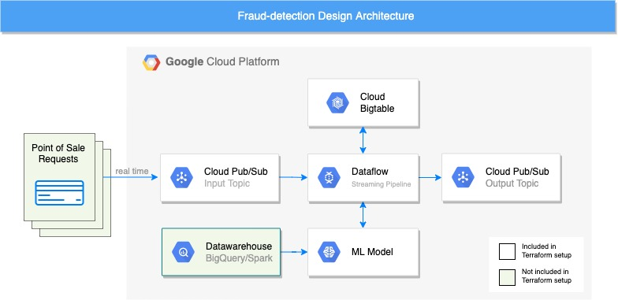

# Credit card fraud-detection using Cloud Bigtable

This sample application aims to build a fast and scalable fraud detection system using Cloud Bigtable as its feature store. The feature store holds Demographic information (customer ids, addresses, etc) and Historical transactions. When deciding if a transaction is fraudulent or not, the feature store is queried to fetch the customer demographic information and the transaction history.

Cloud Bigtable is a great fit to use as a feature store for the following reasons:

1.  **Scalable:** Cloud Bigtable can handle petabytes of data allowing the fraud-detection service to scale to many customers.
    
2.  **Fast:** It has a very low latency which helps in this use case because the system needs to identify if a transaction is fraudulent or not as soon as possible.
    
3.  **Low maintenance:** Lower maintenance compared to relational offerings. Also, Cloud Bigtable supports garbage collection policies which simplify customers’ history management.

## System design

**1.  Input/Output Cloud Pubsub topics:** The real-time transactions arrive at the Cloud Pubsub input topic, and the output is sent to Cloud Pubsub output topic.
    
**2.  ML Model:** The component that decides the probability of a transaction of being fraudulent. This project provides a pre-trained ML model and hosts it on VertexAI (See ML Model section).
    
**3.  Cloud Bigtable as a Feature Store:** Cloud Bigtable stores Customers’ demographics and historical data. The Dataflow pipeline queries Cloud Bigtable in real-time when to get and aggregate the customer’s demographics and historical data.
    
**4.  Dataflow Pipeline:** The streaming pipeline that orchestrates this whole operation. It reads the transaction details from the Cloud Pubsub input topic, queries Cloud Bigtable to build a feature vector that is sent to the ML model, and lastly, it writes the output to the Cloud Pubsub output topic.
    
**5.  Data warehouse (BigQuery, Spark, etc):** This component stores the full history of all transactions queried by the system. It runs batch jobs for continuously training the ML model. Note that this component is outside the scope of this project as a pre-trained ML model is provided for simplicity.

The system design is written using the Terraform framework. All components details can be found in the file **terraform/main.tf** and it includes the components listed above.

## Datasets

This project uses [Sparkov Data Generation Simulator](https://github.com/namebrandon/Sparkov_Data_Generation) to generate the datasets that are used for training the ML model and for testing it.

The directory **terraform/datasets/training_data** stores the datasets used for training the ML model. A pre-trained ML model comes with this project, but a custom ML model can be trained as well.

The directory **terraform/datasets/testing_data** stores the datasets that can be used for testing the ML model. The ML model was never trained against these transactions. Two testing datasets are provided: a dataset containing fraudulent transactions, and another dataset containing legitimate transactions.

## Cloud Bigtable

### Schema design

In Cloud Bigtable the data is organized in tables, which have rows identified by a unique row key, they can have an arbitrary number of columns and for every row key and column multiple versions of value might be stored. This allows storing historical data within the same table row which greatly simplifies query patterns. In this application we’re going to demonstrate how easy it is to store data in Cloud Bigtable for fraud detection use-cases.

This design uses a single table to store all customers information following [table design best practices.](https://cloud.google.com/bigtable/docs/schema-design#tables) The table is structured as follows:

  
  | row key | demographics column family | historical transactions column family |  
------------ | :-----------: | -----------: |  
user_id 1| Customer’s demographic information |Transaction details at time 10|   
 | | | Transaction details at time 7|
 | | | Transaction details at time 4|
 | | | ...|
user_id 2| Customer’s demographic information |Transaction details at time 8|   
 | | | Transaction details at time 7|
 | | | ...|
 
**Row Key:** The row key is the unique userID. 

**Timestamps:** Cloud Bigtable Native timestamps are used rather than putting the timestamp as the row key suffix.

### Column families

The data is separated over two column families. Having multiple column families allows for different garbage collection policies (See garbage collection section).

**Demographics Column Family:** This column family contains the demographics data for customers. Usually, each customer will have one value for each column in this column family.

**History Column Family:** This column family contains the historical transaction that this specific user had before. The dataflow pipeline aggregates the data in this column family and sends them along with the demographics data to the ML model.

### Cloud Bigtable configurations

**Number of nodes**

The Terraform code creates a Cloud Bigtable instance that has 3 nodes. This is a configurable number based on the amount of data and the volume of traffic received by the system. Moreover, Cloud Bigtable supports [autoscaling](https://cloud.google.com/bigtable/docs/autoscaling) where the number of nodes is dynamically selected based on the current system load.

**Garbage Collection Policy**

The current Terraform code does not have any garbage collection policies. However, it could be beneficial for this use case to set a garbage collection policy for the History column family. The ML model doesn’t need to read all the history of the customer. For example, you can set a garbage collection policy to delete all transactions that are older than N months but keep at least M last transactions. The Demographics column family could have a policy that prevents having more than one value in each column. You can read more about Cloud Bigtable Garbage Collection Policies by reading: [Types of garbage collection](https://cloud.google.com/bigtable/docs/garbage-collection#types)  

**Replication**

The current Cloud Bigtable instance configuration does not provide any replication. However, in order to improve the system availability and lower the latency for transactions in different regions, the table can be replicated into multiple zones. This will make the system eventually consistent, but in a use-case like fraud-detection eventual consistency usually works well. You can learn more by reading [Cloud Bigtable replication use cases](https://cloud.google.com/bigtable/docs/replication-overview#use-cases).

## ML Model

This project provides a pre-trained Boosted Trees Classifier ML model that uses similar parameters to what was done here: [How to build a serverless real-time credit card fraud detection solution](https://cloud.google.com/blog/products/data-analytics/how-to-build-a-fraud-detection-solution)

The ML model is located in the path: **terraform/model**