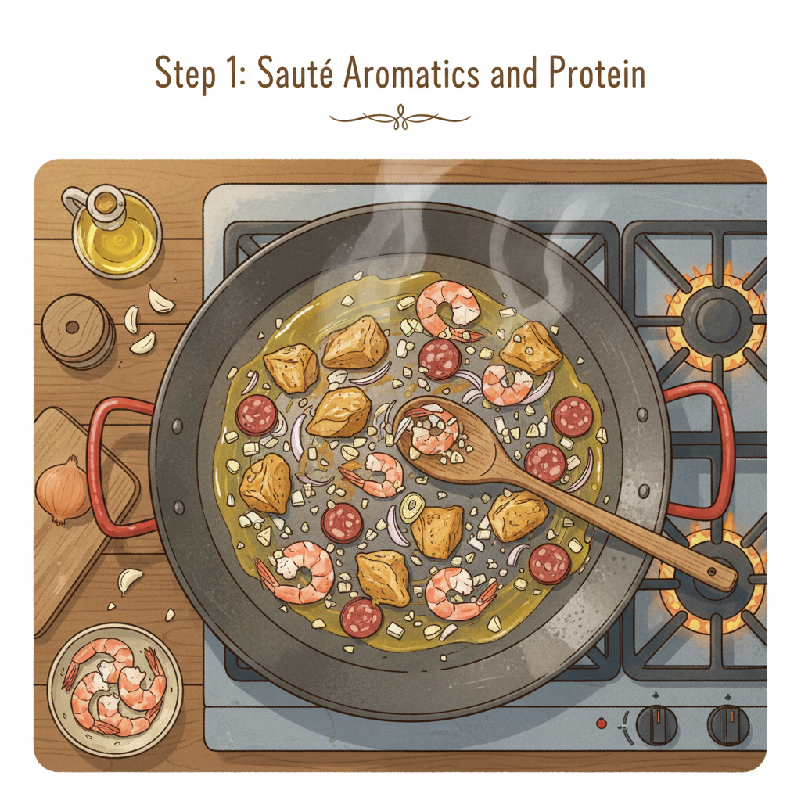
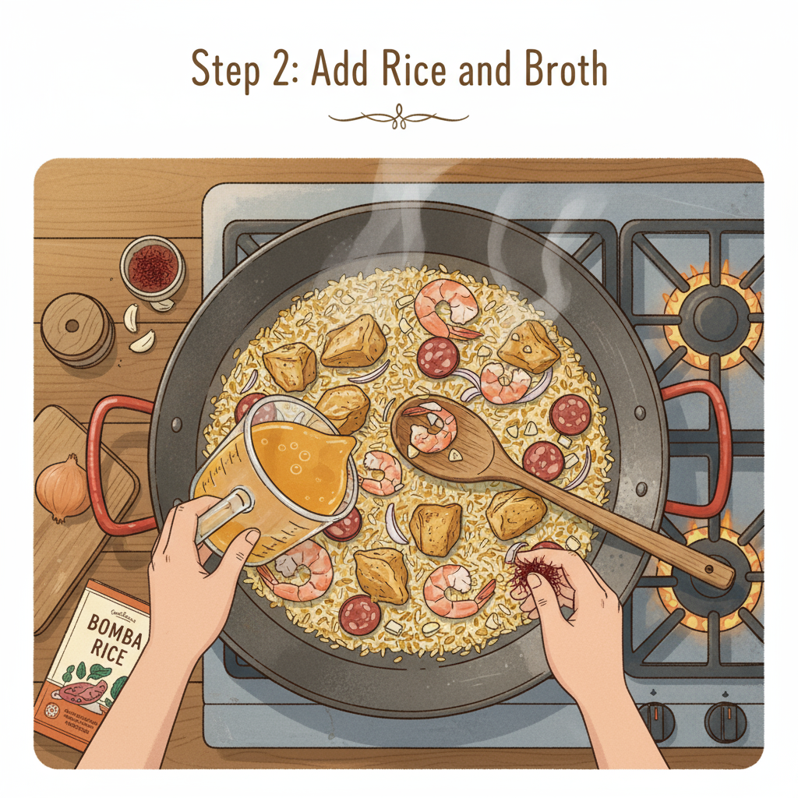
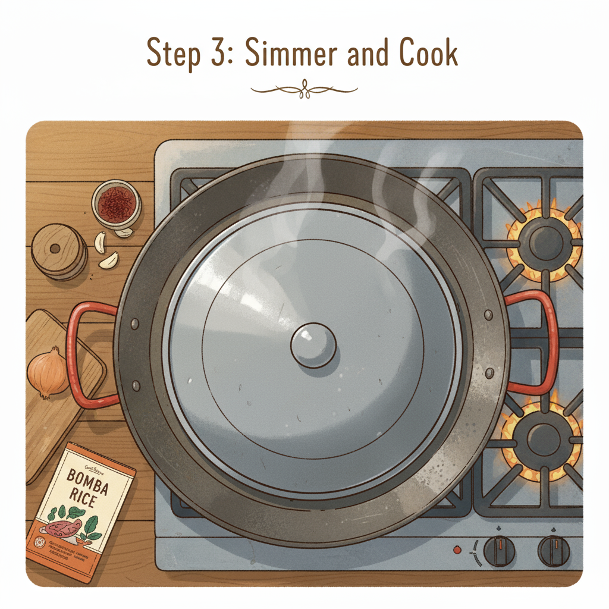
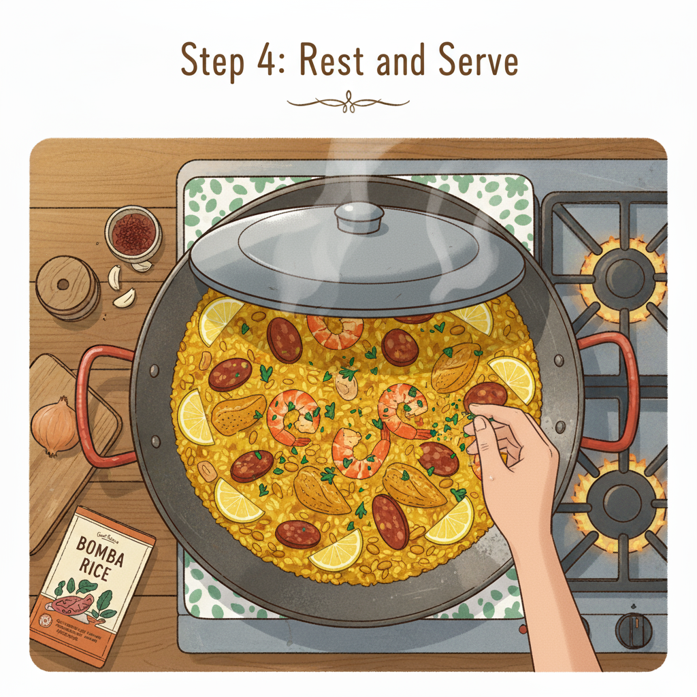

Let's make a delicious and easy paella!

**Step 1: Sauté Aromatics and Protein**

In a large paella pan or wide skillet, heat some olive oil. Add your chopped onions, garlic, and any chosen protein (chicken, shrimp, chorizo work well). Sauté until the protein is browned and the aromatics are fragrant.

 
 **Step 2: Add Rice and Broth**

Stir in your paella rice (Bomba or Calasparra are best) and toast it for a minute or two. Then, pour in your hot chicken or vegetable broth, along with a pinch of saffron threads for color and flavor. Bring to a simmer.

**Step 3: Simmer and Cook**

Reduce the heat to low, cover the pan (if you have a lid that fits, otherwise foil works), and let it simmer without stirring for about 15-20 minutes, or until most of the liquid has been absorbed and the rice is tender.

**Step 4: Rest and Serve**

Once the rice is cooked, remove the pan from the heat and let it rest, still covered, for 5-10 minutes. This allows the flavors to meld and the rice to finish cooking. Garnish with fresh parsley and lemon wedges, then serve immediately!

