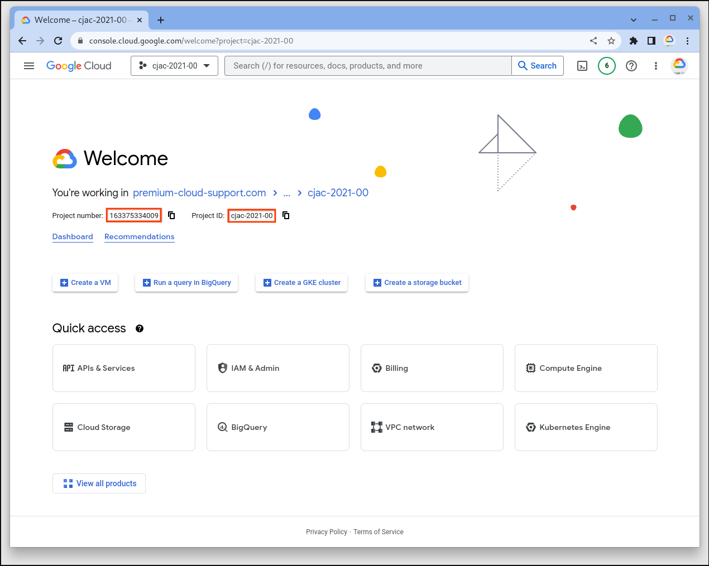

## Vertex AI Workbench with Java Client Library

This is a small sample to create a managed notebook using the Java SDK

### Useful information

Before compiling, open
java-docs-samples/vertex-ai/managed_notebook/src/main/java/com/gcp_aiml/samples/CreateRuntime.java and update the parameters at the top of the `public class CreateRuntime`.  You will need to know these values:

Project ID
Project Number

You can find these values in the cloud console:

.

In order to set a default load balancer provider, this maven package has a file
called io.grpc.LoadBalancerProvider in the java-docs-samples/vertex-ai/managed_notebook/src/main/resources/META-INF/services
directory with the value of $(eval echo
"io.grpc.internal.PickFirstLoadBalancerProvider")

- https://stackoverflow.com/questions/55484043/how-to-fix-could-not-find-policy-pick-first-with-google-tts-java-client

  ```bash
  mkdir -p src/main/resources/META-INF/services
  echo "io.grpc.internal.PickFirstLoadBalancerProvider" > src/main/resources/META-INF/services/io.grpc.LoadBalancerProvider
  ```

  To compile the code, run the following command from this directory, which I
  have called vertex-ai/managed_notebook
  
  `mvn clean compile`

- [To include all dependencies in this .jar
  file](https://stackoverflow.com/questions/574594/how-can-i-create-an-executable-runnable-jar-with-dependencies-using-maven),
  you would run the following:
  
  `mvn assembly:single`

Be sure to enable the API:

```bash
gcloud services enable notebooks.googleapis.com
```

Be sure that you have granted the notebooks.runtimes.create permission to your
service account.  The roles/notebooks.admin role includes this permission, but
may be too permissive.  If this is the case, consider creating a new role with
only the permissions necessary.  The following is an example of granting the
notebooks.admin role:

```bash
gcloud projects add-iam-policy-binding ${PROJECT_ID} \
      --member="serviceAccount:${PROJECT_NUMBER}-compute@developer.gserviceaccount.com" \
      --role="roles/notebooks.admin"
```

Once you have your project configured appropriately, you can launch the code
with:

`java -jar target/managed_notebook-1.0-SNAPSHOT-jar-with-dependencies.jar`
